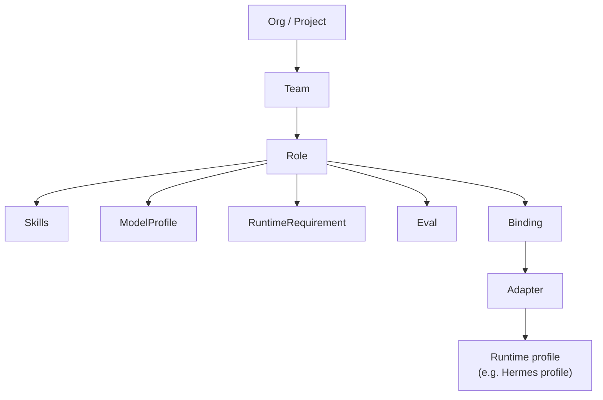

import Slides from '@site/src/components/Slides';

# The Core Model

AOH is built from a small number of nouns. Once you can name them, the rest of the
spec is just detail. If you know Ansible, the fastest way in is: a **pack** is a role,
a **binding** is an inventory entry, an **adapter** is a provider plugin that turns
both into something a specific runtime can run.

<Slides src="decks/core-model.html" title="The AOH Core Model" />

## The five nouns

- **Pack** — the distribution unit. A directory with an `AOH.yaml` manifest and at
  least one skill. This is the thing you version, share, and install.
- **Skill** — the actual capability, written in agentskills `SKILL.md` format:
  instructions plus optional scripts, references, and assets. A
  *process skill* is a plain skill whose body orchestrates other skills by name —
  there's no separate "workflow" kind, it's a convention.
- **Role** — a job function: the WHO. `sre-platform`, `devops-automation`,
  `mlops-training`. A role bundles the skills, model profile, and runtime
  requirements a given job needs.
- **Binding** — a role bound to a target: the WHERE. Cluster, environment, or account.
  Bindings are site-specific and deliberately live outside the pack, in a separate
  site repo — the same split Ansible draws between reusable roles and private
  inventory.
- **Adapter** — compiles a pack (plus an optional binding) into a runtime-native
  profile. Hermes today; Claude Code, Codex, and Goose are next. All runtime-specific
  knowledge lives here — never in the pack spec itself.

Above roles sits the org layer that groups them: a **Team** groups roles for a
project or business unit, a **ModelProfile** declares intent-level model routing
(local worker vs. frontier unblocker), a **RuntimeRequirement** declares capabilities
the runtime should provide, and an **Eval** gates cheap-model trust for one skill.

## Progressive disclosure

You don't need any of the org layer to get value. AOH is built in layers, and only
the first two are mandatory:

- **Layer 0 — `skills/`**: pure agentskills format, works with zero AOH involvement.
- **Layer 1 — `AOH.yaml`**: the pack manifest — name, version. This plus one skill is
  a complete, installable pack.
- **Layer 2 — `roles/`, `teams/`, `models/`, `evals/`, `runtime-requirements/`**: the
  org layer, entirely opt-in.
- **Layer 3 — Bindings**: role × target, living in a separate site repo, opt-in.

Minimum viable pack: `AOH.yaml` + one skill. Five minutes to value — the org model is
something you grow into, not an entry tax.

## How it composes

A team groups roles; a role pulls together the skills, model profile, runtime
requirements, and evals it needs. Bind that role to a target, run it through an
adapter, and you get a generated, disposable runtime profile — never hand-edited,
always reproducible from the pack plus the binding.

## Where to next

- [Engine-Neutral by Design](./engine-neutral) — why runtime knowledge stays out of
  the spec.
- [Safe, Read-Only Agents](./safe-agents) — bindings in practice, enforced by the
  target platform.
