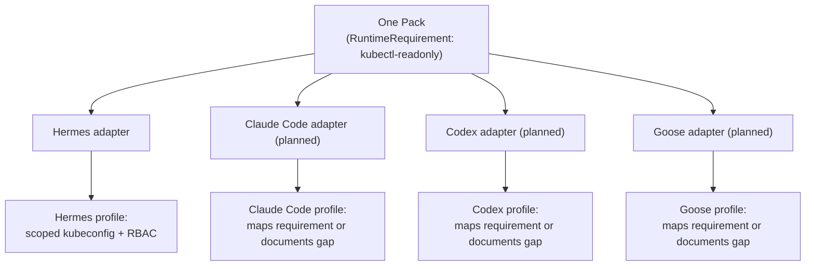

# Engine-Neutral by Design

The one rule that shapes every other design decision in AOH: **AOH organizes,
packages, validates, and adapts a pack. It never executes anything.** Runtimes
execute. This isn't an implementation detail — it's the reason a pack written today
will still be usable when a new agent runtime shows up next year.

## The engine-neutral rule

No runtime-specific concept is allowed to leak into the pack spec or the pack model.
`AOH.yaml`, skills, roles, bindings — none of them mention Hermes, Claude Code, or
any other runtime by name. Runtime knowledge lives in exactly one place: the adapter
for that runtime (`src/aoh/adapters/hermes.py` today). If a concept needs
runtime-specific handling, that handling goes in the adapter, not in the spec.

## Why this matters

It's tempting to let the first runtime's conventions quietly become "the way AOH
works" — a command naming scheme here, a config file shape there. Left unchecked,
that ossifies: the second adapter either has to fake being the first runtime, or the
spec has to be rewritten. AOH draws the line early: the same pack that compiles to a
Hermes profile today should compile to a Claude Code or Codex profile tomorrow
without the pack author changing a line.

## Declared intent, not enforced mechanism

A pack doesn't say "generate a Hermes RBAC provisioning script." It declares a
**RuntimeRequirement** — for example, `kubectl-readonly` — describing the capability
it needs the runtime to provide. Each adapter is responsible for mapping that
declared intent onto whatever native guardrail its platform offers, or for
documenting the gap if it can't. The pack stays honest about what it needs; the
adapter stays honest about what it can deliver.

Only the Hermes adapter exists today; the others are planned. The point of the
diagram is the shape, not the count — one pack, N adapters, each free to map a
requirement onto whatever its platform actually supports.

## The analogy

This is the same shape as **Terraform providers**: one HCL configuration, many
backends (AWS, GCP, Azure...). The resource model in your `.tf` files stays
provider-neutral; the provider plugin is where the cloud-specific API calls live. AOH
draws the same line between the pack spec (provider-neutral) and the adapter
(runtime-specific). Write the pack once; let the adapter worry about the target.

## Where to next

- [Safe, Read-Only Agents](./safe-agents) — a concrete example of a declared
  RuntimeRequirement materialized by the Hermes adapter.
- [AOH for DevOps Engineers](./for-devops-engineers) — the full Ansible/Terraform
  analogy table.
