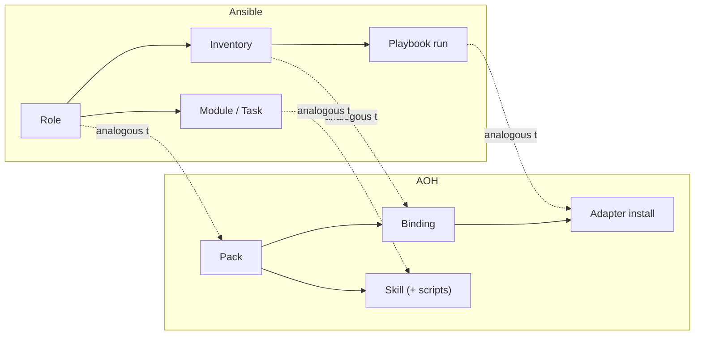

# AOH for DevOps Engineers

If you've written an Ansible role, provisioned with Terraform, or shipped a Helm
chart, you already know most of AOH's shape — the vocabulary is just aimed at agents
instead of servers. AOH's own mental model description puts it directly: **packs are
like roles, bindings are like inventory** — but AOH organizes, packages, validates,
and adapts. It never executes. Runtimes execute.

## The mapping

| DevOps tool concept | AOH equivalent | Note |
|---|---|---|
| Ansible role | Pack | Reusable, shareable capability bundle |
| Ansible inventory | Binding | Site-specific role × target (cluster/env/account) |
| Ansible module / task | Skill (+ scripts) | The actual unit of work |
| Ansible playbook run | Adapter install | Compiles the pack into a runnable profile |
| Terraform provider | Runtime adapter | One model, many backends |
| `terraform plan` | `aoh validate` + eval gate | Check before you run |
| Terraform state drift | Pack-repo-as-source-of-truth (planned drift model) | Copy-install = fork; on the roadmap |
| Helm values | ModelProfile / RuntimeRequirement | Environment-specific knobs |

## Where the analogy holds

- **Roles/packs are reusable and shareable.** Both are meant to be written once and
  used across many targets — a pack, like a role, doesn't know or care which cluster
  it'll eventually run against.
- **Inventory/bindings are site-specific and private.** The split between "what" and
  "where" is the same split Ansible draws between a role and inventory: the role
  stays generic, the inventory (or binding) carries the environment-specific detail
  — which cluster, which namespace, which account.
- **`terraform plan` / `aoh validate`** — both are a check-before-you-run step.
  `aoh validate` checks referential integrity across a pack (skills exist, role
  references resolve, evals point at real skills); the eval gate checks whether a
  cheap model can be trusted to run a given skill, before it gets to.

## Where the analogy breaks

The one place this comparison misleads: **Ansible pushes configuration to stateless
targets. AOH installs into stateful, agent-edited configs.** When Ansible applies a
role, the target has no memory of the previous run beyond what's declared — idempotency
is the whole point. But an installed AOH profile lives inside a runtime's own config
directory, and an agent (or a human) can edit files there directly, during an
incident, the way you'd hand-edit a Helm-rendered manifest. That edit is real work,
and if the pack is reinstalled naively, it's a fork that gets silently discarded —
much closer to the classic **dotfiles-drift** or **Helm-values-drift** problem than to
idempotent Ansible convergence.

This is exactly why the "Terraform state drift" row above is marked planned: AOH's
answer is to keep the pack's git repo as the single source of truth and build a
drift model on top of it (status/sync/capture-style commands), so an agent's
in-the-field improvement has a path back into the shared pack instead of evaporating
on the next install. That model isn't built yet — today, install is a straightforward
copy — but it's the direction the drift decision points, and it's the reason AOH
doesn't claim to be "just Ansible for agents."

## Where to next

- [What is AOH?](./what-is-aoh) — the one-sentence definition and the problems it
  solves.
- [The Core Model](./core-model) — the five nouns behind the mapping table above.
- [Engine-Neutral by Design](./engine-neutral) — the Terraform-provider comparison in
  full.
