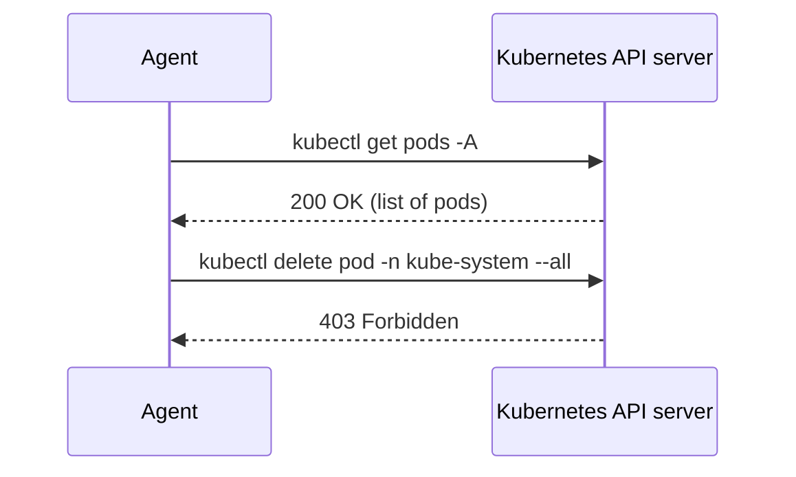

import Slides from '@site/src/components/Slides';

# Safe, Read-Only Agents

The safety thesis behind AOH bindings in one line: **declared intent becomes a
native guardrail, enforced by the target platform, not by the agent's own good
behavior.** The agent doesn't have to be trustworthy for the guardrail to hold —
the guardrail holds even if the agent tries to misbehave.

<Slides src="decks/safe-agents.html" title="Safe Read-Only Agents" />

## How it works

A pack declares a `RuntimeRequirement` like `kubectl-readonly`. When you install that
pack with a binding pointed at a real kubernetes cluster, the Hermes adapter doesn't
just tell the agent "please only read" — it materializes a **dedicated RBAC
identity**: a `ServiceAccount` and `ClusterRole` scoped to `get`/`list`/`watch` only,
plus a **scoped kubeconfig** that the agent's launch script exports. The agent
authenticates as that identity. It isn't that the agent chooses not to run
`kubectl delete` — it's that the Kubernetes API server rejects the request before it
does anything, regardless of what the agent tried to send.

The declared intent → native guardrail chain, concretely:

Both requests come from the agent, using the same scoped kubeconfig. The read
succeeds because the bound `ClusterRole` grants it. The delete fails — not because
the agent second-guessed itself, but because the API server checked the
`ServiceAccount`'s RBAC and refused.

## A separate identity, not just a filtered prompt

The provisioned `ServiceAccount` is distinct from any human operator's credentials.
That separation buys you an audit trail: every action the agent takes is logged under
its own identity, distinguishable from anything a human did with `kubectl` directly.
AOH generates the provisioning script (`provision.sh`); a human runs it once. AOH
itself never touches the cluster — consistent with the rule that AOH organizes and
adapts, it doesn't execute.

:::tip[Honesty note]
Read-only is not read-nothing. The demo `ClusterRole` grants `get`/`list`/`watch` on
everything, which includes every `Secret` in the cluster — fine for a local kind
cluster, not fine for production. A production binding should tighten the role (for
example, an aggregated `view` role plus explicit resources, excluding `secrets`).
:::

## Why not just trust the runtime's own guardrails?

Because it doesn't have one that's aware of the target platform. This was verified,
not assumed: Hermes's own command guardrail is a hardcoded pattern list with zero
`kubectl` awareness — no subcommand allow/deny configuration exists. That means an
unguarded profile would let `kubectl delete` run unprompted. The lesson generalizes:
an agent runtime's built-in safety net is necessarily generic, because it doesn't
know your target platform's semantics. The cluster does. So the cluster is the wall,
not the runtime and not the prompt.

## Where to next

- [KubeOps Read-Only tutorial](../tutorials/kubeops-readonly) — walk through
  provisioning the identity and proving the guardrail yourself, end to end.
