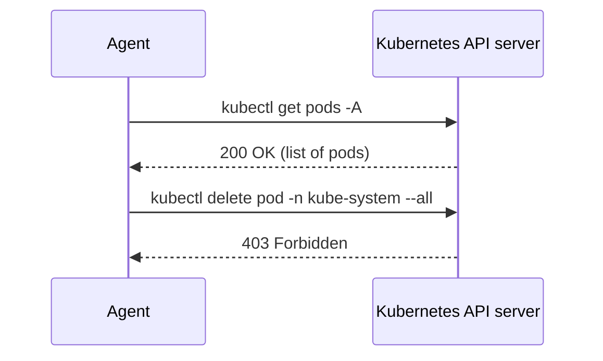
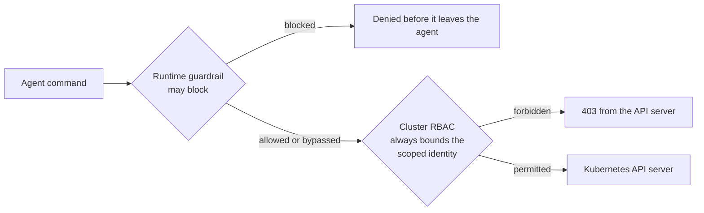

import Slides from '@site/src/components/Slides';

# Safe, Read-Only Agents

The safety thesis behind AOH bindings in one line: **declared intent becomes a
native guardrail, enforced by the target platform, not by the agent's own good
behavior.** The agent doesn't have to be trustworthy for the guardrail to hold —
the guardrail holds even if the agent tries to misbehave.

<Slides src="decks/safe-agents.html" title="Safe Read-Only Agents" />

## How it works

A pack declares a `RuntimeRequirement` like `kubectl-readonly`. When you install that
pack with a binding pointed at a real kubernetes cluster, the Hermes adapter doesn't
just tell the agent "please only read" — it materializes a **dedicated RBAC
identity**: a `ServiceAccount` and `ClusterRole` scoped to `get`/`list`/`watch` only,
plus a **scoped kubeconfig** that the agent's launch script exports. The agent
authenticates as that identity. It isn't that the agent chooses not to run
`kubectl delete` — it's that the Kubernetes API server rejects the request before it
does anything, regardless of what the agent tried to send.

The declared intent → native guardrail chain, concretely:

Both requests come from the agent, using the same scoped kubeconfig. The read
succeeds because the bound `ClusterRole` grants it. The delete fails — not because
the agent second-guessed itself, but because the API server checked the
`ServiceAccount`'s RBAC and refused.

## A separate identity, not just a filtered prompt

The provisioned `ServiceAccount` is distinct from any human operator's credentials.
That separation buys you an audit trail: every action the agent takes is logged under
its own identity, distinguishable from anything a human did with `kubectl` directly.
AOH generates the provisioning script (`provision.sh`); a human runs it once. AOH
itself never touches the cluster — consistent with the rule that AOH organizes and
adapts, it doesn't execute.

:::tip[Honesty note]
Read-only is not read-nothing, but the current `ClusterRole` (`aoh-readonly`,
rendered by `src/aoh/adapters/_k8s.py` and shared by every adapter) is an explicit
resource **allowlist**, not a wildcard — and `secrets` is deliberately not on it,
along with `configmaps`, `nodes/proxy`, `pods/exec`, `pods/attach`,
`pods/portforward`, `serviceaccounts/token`, RBAC objects, and
`certificatesigningrequests`. `auth can-i get secrets` returns `no` against a live
cluster — see [`docs/demos/adapter-validation-2026-07-16.md`](https://github.com/agenticdevops/aoh/blob/main/docs/demos/adapter-validation-2026-07-16.md)
for the flip from `yes` (old wildcard role) to `no` (current allowlist).
:::

## Two walls, honestly labeled

Everything above described one wall: cluster RBAC. Once you point an adapter at
Claude Code or Codex instead of Hermes, there's a second wall in front of it — a
runtime-level guardrail that tries to stop a mutating `kubectl`/`helm` call before it
ever leaves the agent's tool call. That second wall is real, and worth using, but it
is **not the same kind of thing** as RBAC, and conflating the two is exactly the
mistake this page exists to prevent.

| Runtime | Hard enforcement boundary | Best-effort runtime guardrail | Required assumptions |
|---|---|---|---|
| Claude Code | cluster RBAC via scoped identity | `permissions.deny` (settings.json) + a generated `PreToolUse` hook | agent uses the workspace kubeconfig; host credentials are not isolated unless the operator sandboxes the session |
| Codex | cluster RBAC via scoped identity | execpolicy rules (prefix-based, documented gaps) + `approval_policy` | same |
| Hermes | cluster RBAC via scoped identity | none | same |

Only one column in that table is a boundary — a guarantee that holds regardless of
what the runtime's own code does. The other column is a convenience layer: useful,
sometimes very good, but bypassable by construction, because it operates on a
best-effort reading of a command string rather than on an authenticated identity the
API server itself checks.

**Claude Code is the exception worth knowing about.** Of the three runtimes, it is
the only one whose configuration can express **subcommand-level deny** at all — most
people evaluating Claude Code for ops work don't know this exists. The generated
`.claude/settings.json` sets `permissions.deny` for the exact mutation verb list
(`kubectl delete`, `apply`, `edit`, `patch`, `create`, …, `helm upgrade/install/
uninstall/rollback`) and `permissions.allow` for the read verbs plus the pack's own
skill scripts. Denying at the permissions layer alone would still leave gaps for
disguised commands (absolute binary paths, `--context`-first invocations, `sh -c`
wrappers), so the adapter also generates `.claude/hooks/kubectl-guard.sh`, wired as a
`PreToolUse` hook on the Bash tool. It does real normalization — strips `sudo`/`env`/
`time` wrappers, unwraps `sh -c`/`bash -c`, strips a leading absolute path off the
binary, tokenizes past flags to find the verb — and it is **fail-closed**: missing
`jq`, malformed JSON, empty stdin, or any shell metacharacter (`| ; & > < $( ) `` \`)
anywhere in the command all exit 2 (block), never fall through to allow. Live-verified
against real adversarial input in
[`docs/demos/adapter-validation-2026-07-16.md`](https://github.com/agenticdevops/aoh/blob/main/docs/demos/adapter-validation-2026-07-16.md)
§8 — all three forms that bypass Codex's rules file are caught here.

:::danger[Compound commands are blocked outright]
The hook's shell-metacharacter check is unconditional — it rejects `|`, `;`, `&`,
`>`, `<`, `$(...)`, backticks, and backslashes in **any** Bash tool call, whether or
not kubectl/helm is even mentioned. A harmless `kubectl get pods | grep Pending` is
blocked exactly like `kubectl delete pod x`, and a bare `bash script.sh` (no `-c`) is
blocked too, because the hook only knows how to safely unwrap the `sh -c '<command>'`
form. This is a deliberate fail-closed trade-off, not a bug: call the pack's skill
scripts directly (`./script.sh args`, already in `permissions.allow`), or split
multi-stage shell work into separate single-command tool calls instead of chaining
them.
:::

Codex's second wall is thinner. `.codex/rules/kubectl-readonly.rules` uses
codex-cli's `execpolicy` feature — `prefix_rule` entries matching a **literal leading
token-sequence prefix**, with no normalization step. Verified against the real
`codex execpolicy check` CLI, three forms provably bypass it entirely (all return
`{"matchedRules":[]}`, no `decision` at all): `--context`-first invocations, absolute
binary paths, and `sh -c`-wrapped commands. These gaps are documented verbatim in the
generated rules file's own header comment, in `AGENTS.md`, and in the adapter's
`diagnostics` output — Codex has no hook that can actually block a tool call (its
lifecycle hooks are notifications only), so there is no equivalent normalizing
blocker available to close them.

**The cluster gets the last word, every time.** Whether a runtime guardrail blocks a
command, misses it, or doesn't exist at all (Hermes), the scoped ServiceAccount's
RBAC is what the API server actually checks before honoring a mutating request. The
guardrail is a nice-to-have that reduces noise and catches the common case early; the
RBAC boundary is what makes the "physically incapable" claim true regardless of
runtime behavior. Full breakdown, including the fixed resource allowlist and every
gap form's exact command, is in [Runtime Adapters](../reference/adapters).

## Why not just trust the runtime's own guardrails?

Because two of the three don't have one that's platform-aware, and even the one that
does (Claude Code) is a guardrail, not a boundary. This was verified, not assumed:
Hermes's own command guardrail is a hardcoded pattern list with zero `kubectl`
awareness — no subcommand allow/deny configuration exists at all, so an unguarded
Hermes profile would let `kubectl delete` run unprompted. Claude Code's
`permissions.deny` + hook is real and catches more adversarial forms than Codex's
execpolicy rules do, but it only covers commands routed through Claude Code's own
Bash tool, and it fails closed on anything it can't parse rather than guaranteeing
containment. The lesson generalizes: an agent runtime's built-in safety net is
necessarily generic and bypassable by construction, because it is reading a command
string, not checking an authenticated identity. The cluster does the latter. So the
cluster is the wall — the runtime, at best, is a second wall in front of it.

## Where to next

- [KubeOps Read-Only tutorial](../tutorials/kubeops-readonly) — walk through
  provisioning the identity and proving the guardrail yourself, end to end (Hermes).
- [A Read-Only Kubernetes Agent with Claude Code](../tutorials/kubeops-claude-code) —
  the same pack, generated for Claude Code, with the `permissions.deny` + hook wall
  shown live alongside the RBAC wall.
