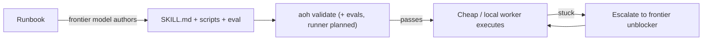

import Slides from '@site/src/components/Slides';

# What is AOH?

AOH — the Agentic Ops Harness — is an engine-neutral harness for agentic DevOps, SRE,
Platform, and MLOps work. Think of it as **"Superpowers for Ops"**: it converts runbooks
into portable, evaluated, git-versioned skills that cheap or local models can execute
repeatably, while frontier models are reserved for authoring those skills and
unblocking the cases where the cheap model gets stuck.

<Slides src="decks/what-is-aoh.html" title="What is AOH?" />

## The analogy

If you've used Ansible, you already have the mental model: a **pack** is like a role,
a **binding** is like an inventory entry. But the comparison has one crucial limit —
**AOH organizes, packages, validates, and adapts. It never executes.** Runtimes
execute. AOH compiles a pack into a runtime-native profile (Hermes today; Claude Code,
Codex, and Goose next) and hands it off. The harness never touches your cluster, your
cloud account, or your terminal directly.

## The problem it solves

Three problems compound to make "just give the agent a runbook" fall apart at any real
scale:

1. **Copy-install drift.** Most agent tools install a skill by copying files into the
   runtime's own config directory. That copy is a fork the moment it lands — an agent
   (or a human) edits the installed copy during an incident, and that fix is now
   orphaned, invisible to the rest of the team, and gone on the next reinstall. AOH's
   model treats the pack's git repo as the source of truth so an improvement has
   somewhere to flow back to — a drift-capture loop (`aoh status`/`sync`/`capture`)
   that is on the roadmap, not built yet. Today, install copies the pack into the
   runtime.
2. **Cheap-model trust.** Handing a capable-but-fallible local model a runbook and
   hoping for the best doesn't scale past the first incident. AOH ties each skill to
   an **eval** — a scenario and success criteria — which is intended to gate whether
   a cheap model can be trusted to run this skill unsupervised. Once an eval runner
   lands (on the roadmap), this gate will enforce that trust check before execution.
3. **Runtime lock-in.** Writing a skill against one agent runtime's config format
   means rewriting it for the next one. AOH separates the skill (what to do) from the
   adapter (how a given runtime consumes it), so one pack compiles to many runtimes
   instead of being rewritten for each.

## How a skill gets from runbook to execution

A frontier model turns institutional knowledge — a runbook, a postmortem, a senior
engineer's habits — into a `SKILL.md`, the deterministic scripts it calls, and an eval
scenario with success criteria. `aoh validate` checks the pack's referential integrity
today; the eval — once an eval runner exists — will gate whether a cheap model can
safely run a skill unsupervised. Until then, cheap or local worker models run skills
day to day and escalate back to a frontier model only when they hit something the
runbook didn't anticipate.

## Where to next

- [The Core Model](./core-model) — the five nouns AOH is built from: Pack, Skill,
  Role, Binding, Adapter.
- [Install AOH](../getting-started/install) — get the CLI running and validate your
  first pack.
