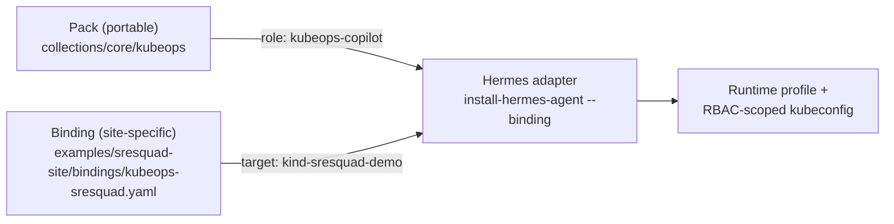

import Quiz from '@site/src/components/Quiz';

# Bindings as Inventory

The previous tutorial used one `Binding` file to point the `kubeops` pack at one
cluster. This tutorial zooms out: why that file lives in a completely separate repo
from the pack, and what that split buys you. If you know Ansible, you already know
the shape — this is that same split, restated for agents.

## The Ansible-inventory analog

Ansible draws a hard line between two kinds of thing:

- **Roles** — reusable, portable, describe *what* to do. You can publish a role to
  Galaxy and it works against anyone's servers.
- **Inventory** — site-specific, describes *which* servers, grouped how, with what
  connection details. Inventory is usually private, usually in its own repo, and it
  is never the thing you publish.

AOH draws the same line:

- **Packs** are the WHO — portable, reusable, safe to publish. `collections/core/kubeops`
  has no idea which cluster it will ever run against, the same way an Ansible role has
  no idea whose fleet it will run against.
- **Bindings** are the WHERE — site-specific, `role × target`. They live in a **site
  repo**, separate from the pack, the same way inventory lives separate from roles.

This repo ships a worked example of a site repo: `examples/sresquad-site/`.

```text
examples/sresquad-site/
  README.md
  bindings/
    kubeops-sresquad.yaml
```

```yaml title="examples/sresquad-site/bindings/kubeops-sresquad.yaml"
apiVersion: openagentix.io/v1alpha2
kind: Binding
metadata:
  name: kubeops-sresquad
spec:
  role: kubeops-copilot
  target:
    kubeContext: kind-sresquad-demo
    namespace: default
```

`spec.role` names a role that must exist in whatever pack you install with this
binding — here, `kubeops-copilot` from `collections/core/kubeops`. `spec.target` is
an open map: today it carries `kubeContext` and a default `namespace` for the
Kubernetes adapter path, but the field isn't hardcoded to Kubernetes-shaped keys —
a future binding for a cloud account target could carry different keys entirely.

## Why bindings live outside the pack

This was a deliberate, recorded decision, not an accident of how the demo happened to
get built (`.planning/PROJECT.md`, 2026-07-14): *"Pack stays portable (the WHO);
binding is site-specific (the WHERE), Ansible inventory split."* A pack that baked in
`kind-sresquad-demo` would stop being portable — it would only ever be useful to
whoever owns that one cluster. Keeping the binding external means:

- the same `kubeops` pack can be bound to a dozen different clusters, each in its own
  binding file, without touching the pack at all;
- a real site repo (unlike `examples/sresquad-site/`, which exists only to demo the
  shape) can be kept private — cluster names, namespaces, and account details are
  operational details you don't necessarily want in a public pack registry;
- `aoh validate` on the pack never needs to know about any binding — bindings load
  and validate standalone (`apiVersion` v1alpha2, `kind: Binding`, `metadata.name`,
  `spec.role`, and a `spec.target` map are all that's required), and the referenced
  role is only checked against the pack at install time, via `--binding`.



## How the adapter materializes it

Nothing about the pack changes when a binding is supplied — the same `install-hermes-agent`
command you'd run without one, plus one flag:

```bash
uv run aoh install-hermes-agent collections/core/kubeops \
  --profile kubeops-sresquad \
  --binding examples/sresquad-site/bindings/kubeops-sresquad.yaml
```

The Hermes adapter reads the binding, resolves `spec.role` against the pack, and —
because the target looks like a Kubernetes context — generates `provision.sh`
alongside the usual profile files. `provision.sh` is what turns `spec.target` into a
real RBAC-scoped identity and kubeconfig on the actual cluster; see
[A Read-Only Kubernetes Agent](./kubeops-readonly) for that walkthrough end to end.
AOH itself never touches the cluster — it only ever generates the script; a human
runs it.

## Installing the same role against a different binding

Because the pack and the binding are independent files, standing up a second
environment for the same role is just a second binding file, not a pack change.
Imagine a `staging` cluster alongside the `sresquad` demo one:

```yaml title="examples/sresquad-site/bindings/kubeops-staging.yaml"
apiVersion: openagentix.io/v1alpha2
kind: Binding
metadata:
  name: kubeops-staging
spec:
  role: kubeops-copilot
  target:
    kubeContext: staging-cluster
    namespace: platform
```

```bash
uv run aoh install-hermes-agent collections/core/kubeops \
  --profile kubeops-staging \
  --binding examples/sresquad-site/bindings/kubeops-staging.yaml
```

Same pack, same role, same skills — a different `provision.sh` generated for a
different cluster, with its own `ServiceAccount` and its own scoped kubeconfig. This
is the entire value of the split: the pack author never has to think about staging
vs. demo vs. production, and the site-repo owner never has to touch pack internals to
add an environment.

## Roadmap note

Bindings today cover the one adapter that exists — Hermes — and the one target shape
that's been built out: Kubernetes RBAC-scoped kubeconfig materialization. Drift
detection between a pack and an already-installed profile, and a standalone eval
runner, are both planned but not implemented; treat any mention of them elsewhere in
these docs as roadmap, not current behavior.

## Next

You've now seen all three tutorials: building a pack from scratch, enforcing
read-only access with RBAC, and keeping site-specific targeting out of the pack. From
here, [Pack Spec](../reference/pack-spec) has the full artifact reference, and
[Artifact Kinds](../reference/artifact-kinds) documents `Binding` alongside every
other kind.

<Quiz questions={[
  {
    prompt: 'In the pack/binding split, what is a pack responsible for, and what is a binding responsible for?',
    options: [
      {text: 'Pack: the portable WHO (skills, roles). Binding: the site-specific WHERE (role × target)', correct: true, explanation: 'Correct — this is the Ansible role/inventory split restated: packs are reusable and safe to publish, bindings are private and site-specific.'},
      {text: 'Pack: which cluster to run on. Binding: which skills to install', correct: false, explanation: 'Backwards. The pack owns skills and roles; the binding owns the target (cluster, namespace) via spec.target.'},
      {text: 'Pack: runtime-specific adapter logic. Binding: engine-neutral spec', correct: false, explanation: 'Neither the pack nor the binding contains runtime-specific adapter logic — that lives only in src/aoh/adapters/. Both the pack spec and the binding spec are engine-neutral.'},
      {text: 'They are interchangeable — either file can declare spec.target', correct: false, explanation: 'Only Binding declares spec.target. A Pack (or the Role inside it) never carries cluster/environment targeting information.'},
    ],
  },
  {
    prompt: 'Where should a real (non-demo) site repo of bindings live, and why?',
    options: [
      {text: 'In a separate repo from the pack, typically private, because it carries site-specific operational details', correct: true, explanation: 'Right — examples/sresquad-site/ is public only because it exists to demo the shape; a real site repo with real cluster names and namespaces is exactly the kind of thing you keep private and separate from the portable pack.'},
      {text: 'Inside the pack, under a bindings/ directory next to roles/', correct: false, explanation: 'The pack layout explicitly does NOT include bindings/ — the spec calls this out directly: Bindings are deliberately not part of pack layout.'},
      {text: 'Inside ~/.hermes/profiles/, alongside the generated runtime profile', correct: false, explanation: '~/.hermes/profiles/ holds generated, disposable adapter output (config.yaml, SOUL.md, provision.sh) — not the source-of-truth binding file that produced it.'},
      {text: 'It doesn\'t matter, as long as validate can find it', correct: false, explanation: 'aoh validate on a pack never looks for bindings at all — a binding loads and validates completely standalone, independent of pack location.'},
    ],
  },
  {
    prompt: 'What can spec.target on a Binding carry? (Select all that apply)',
    multiSelect: true,
    options: [
      {text: 'kubeContext, for pointing an adapter at a specific Kubernetes context', correct: true, explanation: 'Used in both examples in this tutorial: kind-sresquad-demo and staging-cluster.'},
      {text: 'namespace, as a default namespace for the target', correct: true, explanation: 'Also present in both examples — namespace: default and namespace: platform.'},
      {text: 'Other key/value pairs beyond Kubernetes-shaped ones, since spec.target is an open map', correct: true, explanation: 'spec.target isn\'t hardcoded to kubeContext/namespace — it\'s described as an open target map, meant to carry different keys for non-Kubernetes targets (e.g. a cloud account) as those adapters are built.'},
      {text: 'A hardcoded list of allowed kubectl subcommands', correct: false, explanation: 'That is not what spec.target carries, and it is not how read-only enforcement works in this system — enforcement is RBAC on a provisioned identity, not a command allow-list stored in the binding.'},
    ],
  },
  {
    prompt: 'How does the Ansible-inventory analogy map onto AOH?',
    options: [
      {text: 'Pack ≈ Ansible role (portable, reusable); Binding ≈ Ansible inventory entry (site-specific, private)', correct: true, explanation: 'Exactly the mapping used throughout the docs — "if you know Ansible: a pack is a role, a binding is an inventory entry."'},
      {text: 'Pack ≈ Ansible playbook; Binding ≈ Ansible role', correct: false, explanation: 'The analogy specifically targets role vs. inventory, not playbook vs. role — a pack is closer to a role (a bundle of capability) than to a playbook (a sequence of plays).'},
      {text: 'Pack ≈ Ansible inventory; Binding ≈ Ansible role', correct: false, explanation: 'This reverses the mapping. The pack is the portable, reusable side (role); the binding is the site-specific side (inventory).'},
      {text: 'There is no meaningful analogy — AOH\'s model is unrelated to Ansible', correct: false, explanation: 'The opposite is true — AOH\'s README and PROJECT.md explicitly describe the mental model as "Ansible-like (packs ≈ roles, bindings ≈ inventory)."'},
    ],
  },
]} />
