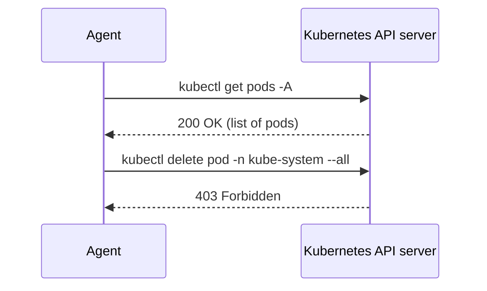

import Quiz from '@site/src/components/Quiz';

# A Read-Only Kubernetes Agent

[Build a Pack](./build-a-pack) built a skill and a role from scratch. This tutorial
takes a shipped pack — `collections/core/kubeops` — and gives its agent a real
kubernetes cluster to triage, while making it **physically incapable** of mutating
that cluster. Not "instructed not to." Incapable: the API server itself rejects the
request, no matter what the agent sends.

This mirrors [`docs/demos/kubeops-readonly.md`](https://github.com/agenticdevops/aoh)
in the repository; run it yourself if you have a `kind` cluster with context
`kind-sresquad-demo`, admin access, and `hermes` installed. Everything below can be
read without a cluster too — the commands and the RBAC-denial proof are copied
verbatim from a real run.

## 1. Validate, then install with a binding

```bash
uv run aoh validate collections/core/kubeops
uv run aoh install-hermes-agent collections/core/kubeops \
  --profile kubeops-sresquad \
  --binding examples/sresquad-site/bindings/kubeops-sresquad.yaml
```

`validate` runs first as usual. `install-hermes-agent` takes a new flag here:
`--binding`, pointing at a `Binding` artifact — `examples/sresquad-site/bindings/kubeops-sresquad.yaml`
in this repo — that says which role binds to which cluster:

```yaml
apiVersion: openagentix.io/v1alpha2
kind: Binding
metadata:
  name: kubeops-sresquad
spec:
  role: kubeops-copilot
  target:
    kubeContext: kind-sresquad-demo
    namespace: default
```

This generates, in `~/.hermes/profiles/kubeops-sresquad/`: the role's skills,
`SOUL.md` (now with a binding block describing the target), `launch.sh` (exports a
scoped `KUBECONFIG`), and — new because a binding was supplied — `provision.sh`.

## 2. Provision the read-only identity

`install-hermes-agent` only ever *writes files*. It does not touch the cluster —
consistent with the rule that AOH organizes and adapts, but never executes. Running
`provision.sh` is the one step a human does, deliberately, once:

```bash
~/.hermes/profiles/kubeops-sresquad/provision.sh
```

This creates:

- a `ServiceAccount` named `aoh-kubeops-sresquad`
- a `ClusterRole` named `aoh-readonly` granting `get`/`list`/`watch` on everything
- a binding of the two
- a scoped `kubeconfig` written next to the script, authenticating as that
  `ServiceAccount` rather than your own credentials

`provision.sh` is idempotent — re-running it is how you refresh the identity later
(see the token note at the bottom of this page).

## 3. Prove the guardrail — no agent involved

This is the part worth doing by hand, without the agent anywhere in the loop, so you
can see the enforcement is real and not just an agent being polite:

```bash
KC=~/.hermes/profiles/kubeops-sresquad/kubeconfig
kubectl --kubeconfig "$KC" get pods -A          # works
kubectl --kubeconfig "$KC" delete pod -n kube-system --all   # Forbidden
kubectl --kubeconfig "$KC" auth can-i delete pods            # no
```

The `get` succeeds because the `ClusterRole` grants it. The `delete` is rejected by
the Kubernetes API server itself, with output like:

```text
Error from server (Forbidden): pods "coredns-abc123" is forbidden: User "system:serviceaccount:default:aoh-kubeops-sresquad" cannot delete resource "pods" in API group "" in the namespace "kube-system"
```

And `auth can-i` confirms the same thing without attempting anything destructive —
it just answers `no`.



Both requests use the same scoped kubeconfig. Nothing about *how* the request was
made changes between the two — only the RBAC policy attached to the identity that
sent it.

## 4. Run the agent

```bash
~/.hermes/profiles/kubeops-sresquad/launch.sh
```

Ask it: *"why is my cluster unhealthy?"* — the copilot should reach for
`node-notready-triage` or `pending-pod-triage` and report evidence-backed findings,
per the role's `responsibilities` (verdict first, then evidence, recommend the
smallest safe next action).

Then ask it to delete a pod. The request goes out over the same scoped kubeconfig
as step 3, the API server denies it the same way, and the role's `SOUL.md`
(generated from `kubeops-copilot`'s stated responsibilities) instructs the agent to
report that denial as the guardrail working — not as an error to route around.

:::tip[Honesty note]
Read-only is not read-nothing. `get`/`list`/`watch` on everything includes every
`Secret` in the cluster — acceptable for a local `kind` demo, not acceptable for
production. A production binding should tighten the `ClusterRole`: for example, an
aggregated `view` role plus explicit resource lists that exclude `secrets`.
:::

## Why this shape

- **Separate agent identity** — audit logs distinguish the agent's actions from
  anything a human does directly with `kubectl`.
- **Enforcement lives in the target platform**, not the agent runtime — the same
  RBAC identity and guardrail carry over unchanged if you point a Claude Code or
  Codex adapter at this pack later; runtime knowledge never leaks into the guardrail
  itself.
- **This was verified, not assumed**: Hermes's own command guardrails have no
  `kubectl` awareness at all — a hardcoded pattern list, no subcommand allow/deny
  configuration. Left ungoverned, `kubectl delete` would run unprompted. The cluster
  has to be the wall, because the runtime isn't one.
- The minted token expires after 720h (30 days). Re-run `provision.sh` to refresh —
  it's idempotent, so re-running it is always safe.

## Next

[Bindings as Inventory](./bindings-inventory) zooms out from this one binding to the
site repo it lives in, and why that split matters.

<Quiz questions={[
  {
    prompt: 'What actually stops the agent from deleting a pod in this setup?',
    options: [
      {text: 'The Kubernetes API server rejects the request based on the ServiceAccount\'s RBAC', correct: true, explanation: 'Correct. The ClusterRole aoh-readonly grants only get/list/watch; the API server enforces that regardless of what the agent, or Hermes, tries to send.'},
      {text: 'The SOUL.md instructions tell the agent not to run destructive commands', correct: false, explanation: 'The SOUL.md does frame denials as "guardrails working," but it is not what stops the delete — the RBAC-scoped kubeconfig does. The prompt is a description of the guardrail, not the guardrail itself.'},
      {text: 'Hermes\'s command guardrail has a kubectl allow/deny list that blocks delete', correct: false, explanation: 'The opposite was verified from source: Hermes\'s guardrail is a hardcoded pattern list with zero kubectl awareness. Without the RBAC binding, kubectl delete would run unprompted.'},
      {text: 'AOH intercepts the kubectl command before it reaches the cluster', correct: false, explanation: 'AOH never executes anything — it only generates provision.sh and the scoped kubeconfig. Enforcement happens entirely at the Kubernetes API server.'},
    ],
  },
  {
    prompt: 'What does provision.sh create?',
    options: [
      {text: 'A ServiceAccount, a ClusterRole scoped to get/list/watch, a binding between them, and a scoped kubeconfig', correct: true, explanation: 'Correct — exactly this: ServiceAccount aoh-kubeops-sresquad, ClusterRole aoh-readonly, the RoleBinding/ClusterRoleBinding tying them together, and a kubeconfig file written next to the script.'},
      {text: 'A new kind cluster to run the demo in', correct: false, explanation: 'provision.sh assumes an existing cluster and kube context (kind-sresquad-demo in this demo) — it does not create clusters.'},
      {text: 'A Hermes profile directory with SOUL.md and launch.sh', correct: false, explanation: 'Those come from install-hermes-agent, which runs earlier and only writes files. provision.sh is the follow-up step that touches the actual cluster.'},
      {text: 'A NetworkPolicy that blocks the agent\'s pod from reaching the API server', correct: false, explanation: 'No NetworkPolicy is involved — the guardrail is RBAC on a scoped identity, not network isolation.'},
    ],
  },
  {
    prompt: 'Why provision a separate ServiceAccount identity instead of reusing your own kubeconfig with a restricted role? (Select all that apply)',
    multiSelect: true,
    options: [
      {text: 'Audit logs distinguish the agent\'s actions from a human operator\'s actions', correct: true, explanation: 'Right — every API call is logged under aoh-kubeops-sresquad, separable from anything logged under your own user identity.'},
      {text: 'The RBAC guardrail carries over unchanged to other runtime adapters later', correct: true, explanation: 'Right — enforcement lives in the target platform (Kubernetes), not the agent runtime, so a Claude Code or Codex adapter pointed at the same binding gets the same guardrail for free.'},
      {text: 'It lets AOH itself perform the delete on the agent\'s behalf if requested', correct: false, explanation: 'AOH never touches the cluster at all, under any identity — it only generates provision.sh, which a human runs.'},
      {text: 'It is required because Kubernetes cannot scope RBAC to a human user\'s existing identity', correct: false, explanation: 'Kubernetes RBAC works fine against a human user\'s identity too — the separate ServiceAccount is a design choice for audit separation, not a technical requirement of RBAC.'},
    ],
  },
  {
    prompt: 'What does "read-only is not read-nothing" mean in this tutorial?',
    options: [
      {text: 'get/list/watch on everything still exposes every Secret in the cluster, so the demo ClusterRole should be tightened for production', correct: true, explanation: 'Exactly the honesty note above: the demo aoh-readonly role is broad enough to read all Secrets. Fine for a local kind cluster, not fine as-is for production.'},
      {text: 'The agent can still read files from the host filesystem even though it cannot touch the cluster', correct: false, explanation: 'This tutorial is scoped to Kubernetes RBAC on the cluster API, not host filesystem access.'},
      {text: 'Read-only agents cannot produce a health report, only raw dumps', correct: false, explanation: 'Read-only is exactly what lets the agent produce a health report — get/list/watch is sufficient to gather everything node-notready-triage and friends need.'},
      {text: 'It means the ClusterRole is a placeholder with zero actual permissions', correct: false, explanation: 'aoh-readonly grants real, working permissions (get/list/watch) — it is not empty, which is precisely the point being made about Secret exposure.'},
    ],
  },
]} />
